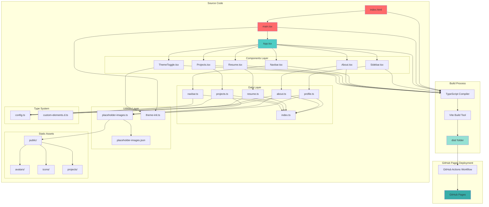
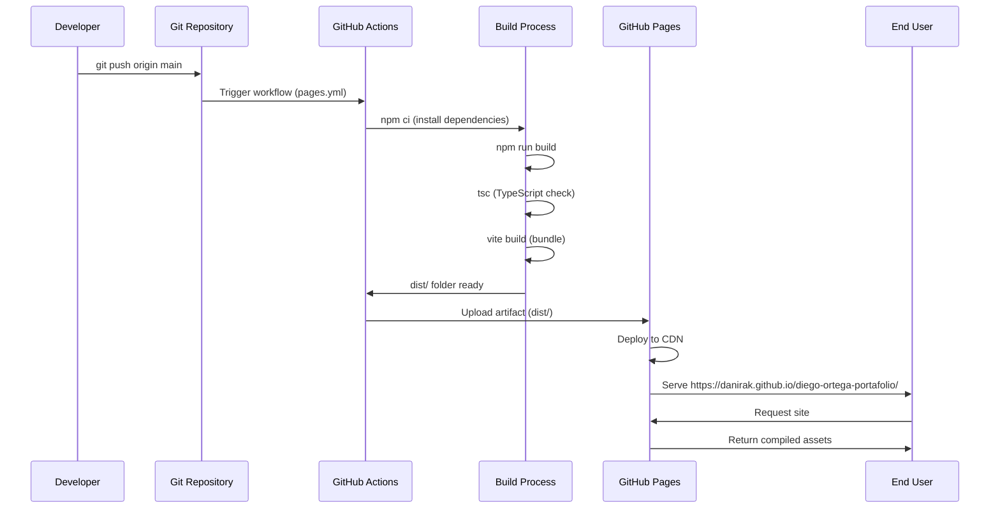

# Arquitectura del Proyecto - Diego Ortega Portfolio

## 📋 Tecnologías Utilizadas

### Frontend Framework & Libraries
- **React 18.2.0** - Librería UI con hooks y componentes funcionales
- **React DOM 18.2.0** - Renderizado en el DOM

### Build Tools & Bundler
- **Vite 5.0.8** - Build tool rápido con HMR (Hot Module Replacement)
- **@vitejs/plugin-react 4.2.1** - Plugin oficial de React para Vite

### Lenguaje & Type Safety
- **TypeScript 5.2.2** - Superset tipado de JavaScript
- **@types/react 18.2.43** - Tipos para React
- **@types/react-dom 18.2.17** - Tipos para React DOM

### Linting & Code Quality
- **ESLint 8.55.0** - Linter para identificar problemas en el código
- **@typescript-eslint/eslint-plugin 6.14.0** - Reglas ESLint para TypeScript
- **@typescript-eslint/parser 6.14.0** - Parser de TypeScript para ESLint
- **eslint-plugin-react-hooks 4.6.0** - Reglas para React Hooks
- **eslint-plugin-react-refresh 0.4.5** - Reglas para Fast Refresh

### Deployment
- **GitHub Actions** - CI/CD automatizado
- **GitHub Pages** - Hosting estático

### Otras Tecnologías
- **Ionicons 7.1.0** - Biblioteca de iconos (CDN)
- **Google Fonts (Poppins)** - Tipografía personalizada (CDN)

---

## 🏗️ Estructura de Arquitectura

### Patrón Arquitectónico
**Component-Based Architecture con Separación de Responsabilidades**

El proyecto sigue una arquitectura modular con separación clara entre:
- **Presentación** (Components)
- **Datos** (Data layer)
- **Tipos** (Type definitions)
- **Utilidades** (Lib)
- **Assets** (Public)

### Estructura de Directorios

```
diego-ortega-cv/
│
├── .github/
│   └── workflows/
│       └── pages.yml              # CI/CD workflow para GitHub Pages
│
├── public/                         # Assets estáticos
│   ├── .nojekyll                  # Desactiva Jekyll en GitHub Pages
│   ├── avatars/                   # Imágenes de perfil
│   ├── icons/                     # Iconos de tecnologías
│   ├── images/                    # Imágenes generales
│   ├── projects/                  # Imágenes de proyectos
│   ├── logo.ico                   # Favicon
│   └── logo.svg                   # Logo SVG
│
├── src/
│   ├── components/                # Componentes React
│   │   ├── About.tsx              # Sección "Acerca de mí"
│   │   ├── Navbar.tsx             # Barra de navegación
│   │   ├── Projects.tsx           # Portfolio de proyectos
│   │   ├── Resume.tsx             # Currículum (educación, experiencia)
│   │   ├── Sidebar.tsx            # Sidebar con info de contacto
│   │   └── ThemeToggle.tsx        # Botón toggle día/noche
│   │
│   ├── data/                      # Configuración de datos
│   │   ├── about.ts               # Datos de "About Me"
│   │   ├── index.ts               # Exportaciones centralizadas
│   │   ├── navbar.ts              # Items del menú de navegación
│   │   ├── profile.ts             # Información del perfil (sidebar)
│   │   ├── projects.ts            # Datos de proyectos
│   │   └── resume.ts              # Datos de CV (educación, experiencia)
│   │
│   ├── lib/                       # Utilidades y helpers
│   │   ├── placeholder-images.json    # Registro de imágenes
│   │   ├── placeholder-images.ts      # Helpers para gestión de imágenes
│   │   ├── theme-init.ts          # Inicialización de tema día/noche
│   │   └── README.md              # Documentación del sistema de imágenes
│   │
│   ├── types/                     # Definiciones de tipos TypeScript
│   │   ├── config.ts              # Tipos para configuraciones
│   │   └── custom-elements.d.ts   # Tipos para elementos custom (ion-icon)
│   │
│   ├── css/                       # Estilos globales
│   │   └── style.css              # Estilos principales con tema día/noche
│   │
│   ├── App.tsx                    # Componente raíz de la aplicación
│   ├── main.tsx                   # Entry point de React
│   └── vite-env.d.ts              # Tipos de entorno de Vite
│
├── scripts/                       # Scripts de automatización
│   ├── run-architecture.md        # Script de análisis arquitectónico
│   └── run-pm.md                  # Script de gestión de proyecto
│
├── index.html                     # HTML principal (entry point de Vite)
├── vite.config.ts                 # Configuración de Vite
├── tsconfig.json                  # Configuración de TypeScript
├── tsconfig.node.json             # Config TS para scripts de Node
├── .eslintrc.cjs                  # Configuración de ESLint
├── package.json                   # Dependencias y scripts npm
├── AGENTS.md                      # Reglas para agentes AI
├── MIGRATION.md                   # Documentación de migración
├── ARCHITECTURE.md                # Este archivo (documentación arquitectónica)
└── README.md                      # Documentación principal
```

---

## 📊 Diagrama de Arquitectura (Mermaid)



---

## 🔄 Flujo de Datos

### 1. Inicialización
```
index.html → main.tsx → theme-init.ts (inicializa tema) → App.tsx
```

### 2. Renderizado de Componentes
```
App.tsx → [Sidebar, Navbar, About, Resume, Projects, ThemeToggle]
```

### 3. Carga de Datos
```
Component → data/*.ts → index.ts (export unificado)
```

### 4. Gestión de Imágenes
```
Component → getImageUrl() → placeholder-images.json → public/
```

### 5. Sistema de Tema
```
ThemeToggle → localStorage + isDaytime() → CSS variables [data-theme]
```

### 6. Build & Deploy
```
npm run build → tsc (type check) → vite build → dist/ → GitHub Actions → GitHub Pages
```

---

## 🎨 Características Arquitectónicas

### 1. **Separación de Responsabilidades**
- **Components**: Solo lógica de presentación
- **Data**: Configuración centralizada sin lógica de negocio
- **Lib**: Funciones reutilizables y helpers
- **Types**: Type safety con TypeScript

### 2. **Sistema de Imágenes Centralizado**
- JSON registry con metadata de imágenes
- Funciones helper type-safe
- Soporte para múltiples categorías (avatars, icons, projects)
- Integración con Vite base URL para deployment

### 3. **Theme System Dinámico**
- Detección automática día/noche (6AM-6PM)
- Persistencia con localStorage
- Inicialización pre-render para evitar flash
- CSS variables para transiciones suaves

### 4. **Routing Hash-Based**
- Navegación sin recarga (#about, #resume, #portfolio)
- Validación de URLs con redirect a #about
- Compatible con GitHub Pages

### 5. **Type Safety Completo**
- Interfaces para todas las configuraciones
- Type checking en build time
- Autocompletado en desarrollo

### 6. **CI/CD Automatizado**
- Build automático en push a main
- Type checking y linting en CI
- Deployment automático a GitHub Pages
- Artifact-based deployment (dist/)

---

## 🚀 Pipeline de Deployment



---

## 📦 Módulos Clave

### **placeholder-images.ts**
Sistema de gestión de imágenes con:
- `getImageById()` - Buscar imagen por ID
- `getImageUrl()` - Obtener URL completa con base path
- `getImagesByHint()` - Filtrar por categoría
- `getImageDescription()` - Obtener descripción localizada

### **theme-init.ts**
Inicialización de tema con:
- `isDaytime()` - Detecta si es horario diurno (6-18h)
- `initTheme()` - Aplica tema desde localStorage o hora del día
- Ejecutado antes de React render para evitar flash

### **data/index.ts**
Exportación centralizada de todas las configuraciones de datos para facilitar imports.

---

## 🔧 Configuración de Build

### Vite Config
- **Base Path**: `/diego-ortega-portafolio/` (GitHub Pages subdirectory)
- **Plugins**: React Fast Refresh
- **Output**: `dist/` con assets hashed

### TypeScript Config
- **Target**: ES2020
- **Module**: ESNext con resolución Node
- **JSX**: react-jsx (automatic runtime)
- **Strict mode**: Habilitado
- **No emit**: true (Vite maneja el bundling)

---

## 📝 Notas de Migración

El proyecto fue completamente migrado de:
- **Origen**: Python + Jinja2 + YAML → Generación de HTML estático
- **Destino**: React + TypeScript + Vite → SPA moderna

La migración eliminó toda la infraestructura Python (config/, contexto/, *.py, poetry) y convirtió los datos YAML en módulos TypeScript tipados en `src/data/`.

---

**Última actualización**: 29 de noviembre de 2025
